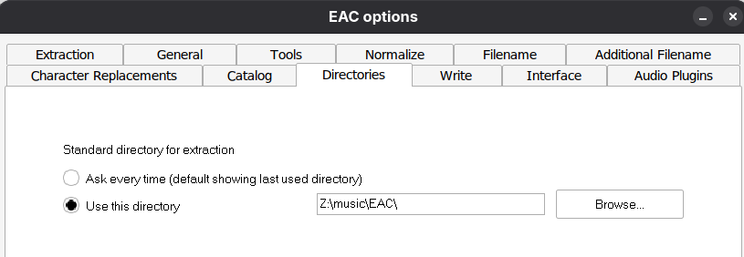
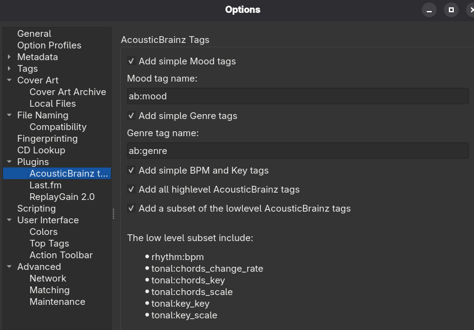

Ripping CD Audio Workflow
=========================

My humble *"bit perfect"* ripping setup & configuration.

Table of content
================

<!-- @import "[TOC]" {cmd="toc" depthFrom=1 depthTo=4 orderedList=true} -->
<!-- code_chunk_output -->

1. [Intro](#intro)
2. [Tools & Settings](#tools--settings)
    1. [Exact Audio Copy (EAC)](#exact-audio-copy-eac)
        1. [Settings](#settings)
            1. [EAC Options](#eac-options)
            2. [Drive Options](#drive-options)
            3. [Compression Options](#compression-options)
            4. [Metadata Options](#metadata-options)
        2. [Rip process](#rip-process)
    2. [CUETools](#cuetools)
        1. [Settings](#settings-1)
        2. [Verifying Process](#verifying-process)
    3. [MusicBrainz Picard](#musicbrainz-picard)
        1. [Setup & requirements](#setup--requirements)
        2. [Tag & Move to library Process](#tag--move-to-library-process)
3. [Convert to M4A/AAC for mobile usage](#convert-to-m4aaac-for-mobile-usage)
    1. [fre:ac](#freac)
        1. [fre:ac Settings](#freac-settings)
            1. [Encoders](#encoders)
            2. [Output files](#output-files)
            3. [Verification](#verification)
            4. [Metadata -> Album Art](#metadata---album-art)
    2. [MP3Tag](#mp3tag)
        1. [Add an action to adjust cover size](#add-an-action-to-adjust-cover-size)
        2. [Process](#process)
    3. [fatsort](#fatsort)
4. [Wine](#wine)
5. [Sources](#sources)

<!-- /code_chunk_output -->

# Intro

While using exclusively Linux I wanted to keep logs from EAC Rips so I included a basic script to create the Wine prefix I use at the end of this guide.

Global process:
- EAC rip securely CD Audio
- CUETools verify the generated FLAC files (even if it has been done with EAC, double check doesn't hurt)
- MusicBrainz Picard tags and moves audio files to master library

For usage on various devices that does not support FLAC, I convert the desired albums to M4A/AAC:
- Select a bunch of albums from my library and convert them with fre:ac which also adds the cover to every converted files
- Use Mp3Tag to resize covers (better player compat and saves some space)


# Tools & Settings

## Exact Audio Copy (EAC)

### Settings

Avoid to run the wizard and just follow any well documented various "perfect-bit" recommendations (check [Sources](#sources)).

Here are my settings:

#### EAC Options





#### Drive Options


**Offsets should be automatically setup during the AccuRip test.**


#### Compression Options


Additional command-line options:
`-8 -V -T "ARTIST=%artist%" -T "TITLE=%title%" -T "ALBUM=%albumtitle%" -T "DATE=%year%" -T "TRACKNUMBER=%tracknr%" -T "GENRE=%genre%" -T "PERFORMER=%albuminterpret%" -T "COMPOSER=%composer%" %haslyrics%"tag-from-file=LYRICS="%lyricsfile%"%haslyrics% -T "ALBUMARTIST=%albumartist%" -T "DISCNUMBER=%cdnumber%" -T "TOTALDISCS=%totalcds%" -T "TOTALTRACKS=%numtracks%" -T "COMMENT=%comment%" %source% -o %dest%`


#### Metadata Options

Configure to fit your needs as you wish.

### Rip process

- detect gaps


- create CUE file


- test & compress


> Note:
> If you don't want to read logs, you can upload them here [Cambia](https://logs.musichoarders.xyz/) to get a visual summary of your RIPs.

## CUETools

### Settings

- write all accurip tags to files
- Verify AccuRip (write ac tags and log file)


### Verifying Process

- Select `Verify` and `only if rip log present`.
- Open the directory containing the `.cue` file and `.flac`, select the `.cue` file
- Click `Go`


## MusicBrainz Picard

### Setup & requirements

First, install the file naming script:
- Download the script [Salty's MusicBrainz Picard Naming Script](https://musichoarders.xyz/assets/doc/salty-picard-naming-script.txt)
- Install the script in MusicBrainz Picard


Open options (Menu: Options -> Options...)

1) General
  - Login your MusicBrainz account
2) Covert Art


4) Covert Art Archive
Select the images you want to download for each release. I choose all.


5) File Naming
- `Destination directory`: choose your output directory
- Select the file naming script previously installed


6) Fingerprinting


7) Plugins
- AccousticBrainz



- Last.fm


- ReplayGain v2.0
Install ReplayGain binaries from here https://github.com/complexlogic/rsgain


### Tag & Move to library Process

- Add files
- Cluster


- Right click the cluster (album) choose `PLugins -> Calculate Cluster ReplayGain as Album...`


- Match release
  - Ideally use

  - Alternatively use `Lookup` or `Scan`


- Update tags manually if needed
- Save files


# Convert to M4A/AAC for mobile usage

## fre:ac

### fre:ac Settings

#### Encoders


##### FDK-AAC Encoder Settings

- use 192Kbps per channel (total>320Kbps but should work on every players)
- maximum low pass filter (20KHz)


#### Output files


Filename pattern, one of:
- `<albumartist> - <album>/<disc>-<track> - <artist> - <title>`
- `<albumartist>/<album>/<disc>-<track> - <title>`

#### Verification


Disable all verification, we are doing loosy encoding so nevermind.

#### Metadata -> Album Art


Make sure to check `Restrict file names` and enter `front` as name so only the first cover file matching `front.png` or `front.jpg` will be embedded in the encoded file.

If you enter a file pattern with jokers (like `front*`) fre:ac will embed ALL files matching the pattern, this is useless and will make the encoded files pretty heavy.

Also set `File size limit` to `unlimited`.

## MP3Tag

### Add an action to adjust cover size

Follow these steps:


Select Jpeg format and 300x300 pixels size for maximum compatibility.

And now you have to confirm everything by clicking `OK`

### Process

- Add directories where are your M4A/MP4/MP3 files (usualy output directory of `fre:ac`)
- Select all files
- Right click the selection and apply the `Adjust Cover` action


## fatsort

Some player are really dumb and either sort tracks based on title tag or even weirder some sort tracks based on file creation time. For the last I use `fatsort`.

Insert the USB drive, make sure the USB partition is not mounted and run:
`fatsort /dev/sda1`

# Wine

Script to automate wine prefix creation compatible with EAC & CUETools.

```shell
eac_install=$HOME/Downloads/eac-1.8.exe
export WINEPREFIX=$HOME/wineprefixes/eac64
export WINEARCH=win64
mkdir -p "$WINEPREFIX"
# Set up the prefix if missing.
if [ ! -d "${WINEPREFIX}/.wine" ]; then
  echo "Setting up a prefix for EAC/CUETools. Stand by!"
  WINEDLLOVERRIDES="mscoree=" wine wineboot
  winetricks -q dotnet20 dotnet40 dotnet48 vcrun2008 vcrun2022
fi
wine $eac_install
cd $WINEPREFIX/drive_c/Program\ Files\ \(x86\)/Exact\ Audio\ Copy/ && regsvr32 sql*
```

# Sources

- [Exact Audio Copy](https://www.exactaudiocopy.de/en/)
- [EAC Setup & Config](https://web.archive.org/web/2/https://flemmingss.com/perfect-cd-ripping-to-flac-with-exact-audio-copy/)
- [Guides from HydrogenAudio](https://wiki.hydrogenaudio.org/index.php?title=Category:Guides)
- [Music Hoarders](https://musichoarders.xyz/)
- [Cambia Logs Analyzer](https://logs.musichoarders.xyz/)

